<div align="center">

# RoommateSync

**Find a room, split costs, manage house life — all in one place.**

A full-stack PHP web application for university students and young professionals to discover compatible roommates, browse rental listings, split household bills, schedule property viewings, and communicate through a built-in social layer.


</div>

---

## Table of Contents

- [Project Overview](#project-overview)
- [Screenshots](#screenshots)
- [Architecture](#architecture)
  - [System Architecture](#system-architecture)
  - [Data Flow Diagram](#data-flow-dfd)
  - [Entity Relationship Diagram](#entity-relationship-diagram)
  - [UML Use Case Diagram](#uml-use-case-diagram)
  - [UML Class Diagram](#uml-class-diagram)
  - [UML Sequence Diagrams](#uml-sequence-diagrams)
  - [UML Activity Diagrams](#uml-activity-diagrams)
  - [UML State Machine Diagrams](#uml-state-machine-diagrams)
  - [UML Component Diagram](#uml-component-diagram)
  - [UML Deployment Diagram](#uml-deployment-diagram)
  - [UML Communication Diagram](#uml-communication-diagram)
  - [UML Timing Diagram](#uml-timing-diagram)
  - [UML Object Diagram](#uml-object-diagram)
  - [UML Package Diagram](#uml-package-diagram)
- [Technology Stack](#technology-stack)
- [Project Structure](#project-structure)
- [Features](#features)
- [Database Schema](#database-schema)
- [Jira Sprint Management](#jira-sprint-management)
- [Zephyr Test Management](#zephyr-test-management)
- [Work Distribution](#work-distribution)
- [GitHub Contribution Graph](#github-contribution-graph)
- [Getting Started](#getting-started)
- [Demo Accounts](#demo-accounts)
- [API Endpoints](#api-endpoints)

---

## Project Overview

RoommateSync is a university ISD (Information System Design) project built by a team of 3 students. It solves the real problem of finding compatible roommates and managing shared housing in Bangladesh, where students frequently move to different cities for university or work.

### Core Problem
Students and young professionals relocating to cities like Dhaka struggle to find trustworthy roommates, verify rental listings, and manage shared expenses. Current solutions are fragmented across Facebook groups, word-of-mouth, and manual spreadsheets.

### Our Solution
A unified web platform with 7 integrated modules:

| # | Module | What It Does |
|---|--------|-------------|
| 1 | **Rental Marketplace** | Browse, filter, and search listings by price, room type, and location with real-time updates |
| 2 | **Bill Split Calculator** | Split household bills proportionally by income with optional database logging |
| 3 | **Viewing Booking** | Schedule 30-minute property viewing slots with automatic conflict prevention |
| 4 | **Listing Upload** | Landlords create listings with image upload, house rules, and validation |
| 5 | **Peer Review** | Rate roommates on cleanliness and communication with aggregated scores |
| 6 | **Chat** | Real-time polling-based messaging between accepted connections |
| 7 | **Connect** | Double opt-in connection system that unlocks chat only when both parties accept |

---

## Screenshots

> Replace the placeholder paths below with actual screenshots from the running application.

| Page | Screenshot |
|------|-----------|
| **Dashboard** |  |
| **Marketplace** |  |
| **Bill Split** |  |
| **Booking** |  |
| **Create Listing** |  |
| **Connect** |  |
| **Chat** |  |
| **Peer Review** |  |
| **Login** |  |
| **Register** |  |

### How to Capture Screenshots

```bash
# 1. Start the dev server
php -S localhost:8000

# 2. Import database (if not done)
# Import Database/schema.sql then Database/seed.sql into MySQL

# 3. Open each page in browser, take full-page screenshots
# Save them in a screenshots/ folder at project root
```

---

## Architecture

### System Architecture

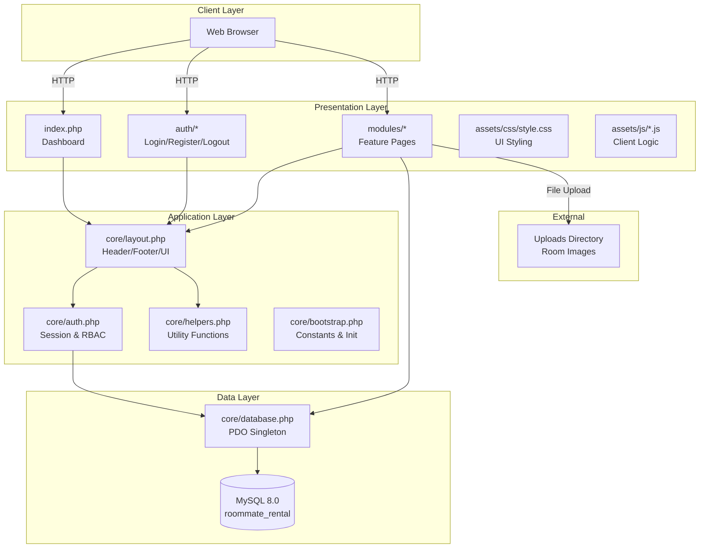

### Data Flow (DFD)

#### Level 0 — Context Diagram

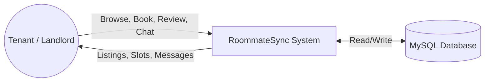

#### Level 1 — Major Processes

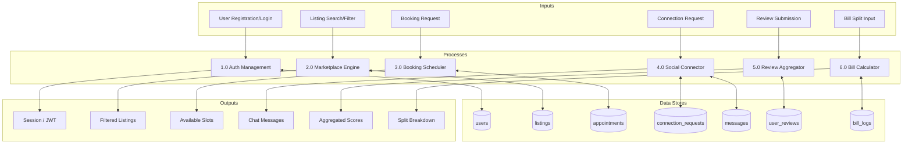

#### Level 2 — Booking Process Detail

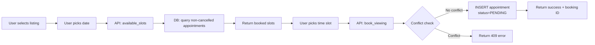

### Entity Relationship Diagram

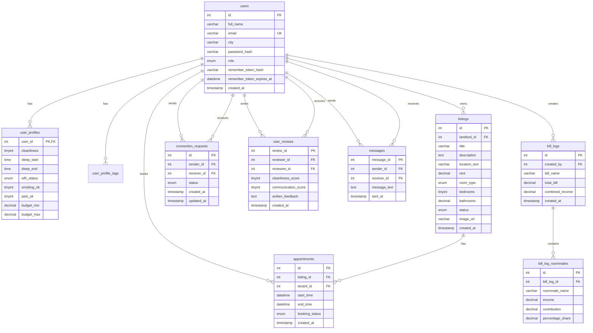

### UML Use Case Diagram

```mermaid
graph TB
    Tenant((Tenant))
    Landlord((Landlord))
    Admin((Admin))

    subgraph RoommateSync
        UC1[Register / Login]
        UC2[Browse Listings]
        UC3[Filter by Price/Type/Location]
        UC4[Book Viewing Slot]
        UC5[Upload Room Listing]
        UC6[Split Bill by Income]
        UC7[Send Connection Request]
        UC8[Accept Connection]
        UC9[Send Chat Message]
        UC10[Submit Peer Review]
        UC11[View Review Summary]
        UC12[Manage Users]
        UC13[Logout]
        UC14[Save Bill Log]
        UC15[Cancel Booking]
    end

    Tenant --> UC1
    Tenant --> UC2
    Tenant --> UC3
    Tenant --> UC4
    Tenant --> UC6
    Tenant --> UC7
    Tenant --> UC8
    Tenant --> UC9
    Tenant --> UC10
    Tenant --> UC11
    Tenant --> UC13
    Tenant --> UC14
    Tenant --> UC15

    Landlord --> UC1
    Landlord --> UC5
    Landlord --> UC2
    Landlord --> UC9
    Landlord --> UC13

    Admin --> UC12
    Admin --> UC1
    Admin --> UC13

    UC7 ..> UC8 : <<include>>
    UC8 ..> UC9 : <<include>>
```

### UML Class Diagram

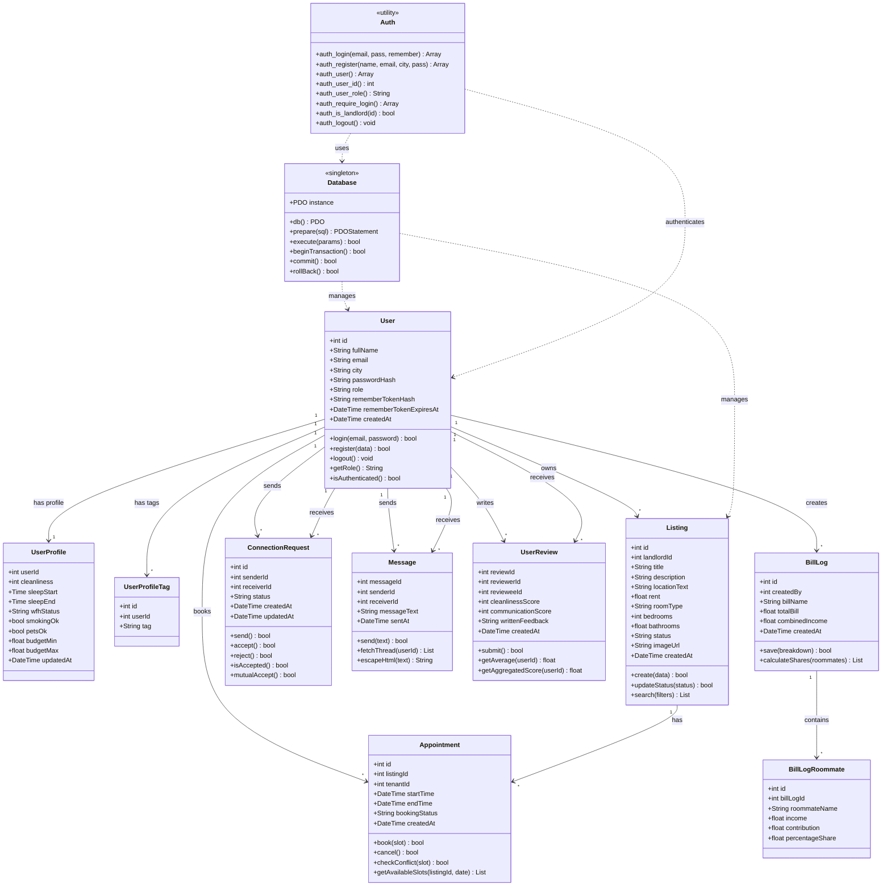

### UML Sequence Diagrams

#### Booking a Viewing

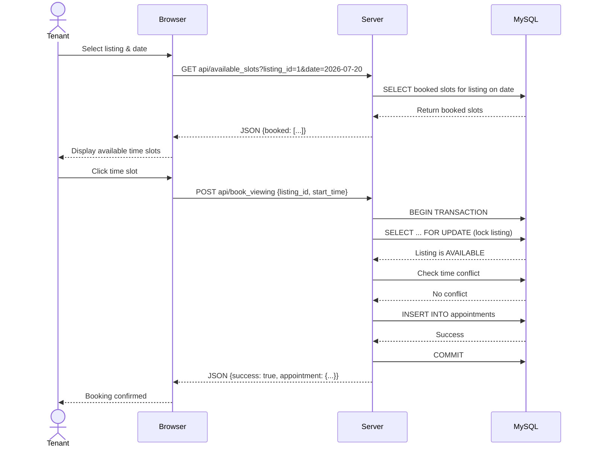

#### Connection & Chat Flow

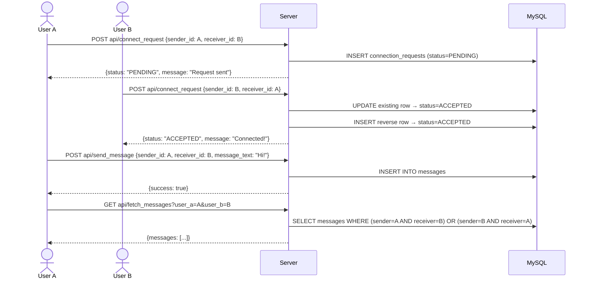

#### User Registration & Login

```mermaid
sequenceDiagram
    actor U as User
    participant B as Browser
    participant S as Server
    participant DB as MySQL

    Note over U,B: Registration Flow
    U->>B: Fill registration form
    B->>S: POST /auth/register.php {full_name, email, city, password}
    S->>S: Validate input (length, format)
    S->>DB: SELECT COUNT(*) WHERE email = ?
    DB-->>S: 0 (not taken)
    S->>S: password_hash(password, PASSWORD_BCRYPT)
    S->>DB: INSERT INTO users (full_name, email, city, password_hash, role)
    DB-->>S: Success
    S->>S: session_regenerate_id()
    S->>S: $_SESSION['user_id'] = new_id
    S-->>B: 302 Redirect to index.php?registered=1
    B-->>T: Dashboard with flash message

    Note over U,B: Login Flow
    U->>B: Fill login form + check Remember Me
    B->>S: POST /auth/login.php {email, password, remember}
    S->>DB: SELECT * FROM users WHERE email = ?
    DB-->>S: User row
    S->>S: password_verify(password, hash)
    alt Valid password
        S->>S: session_regenerate_id()
        S->>S: $_SESSION['user_id'] = user_id
        opt Remember Me checked
            S->>S: Generate random token
            S->>S: hash(token)
            S->>DB: UPDATE users SET remember_token_hash = ?
            S->>B: Set-Cookie: remember_token=token; Max-Age=30d
        end
        S-->>B: 302 Redirect to index.php?signed_in=1
    else Invalid password
        S-->>B: 302 Redirect to login.php?error=1
    end
```

### UML Activity Diagrams

#### Booking Activity Flow

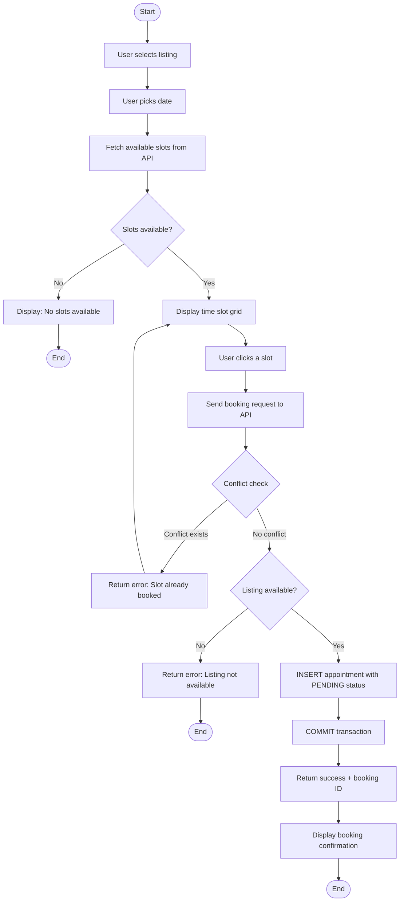

#### Connection Request Activity Flow

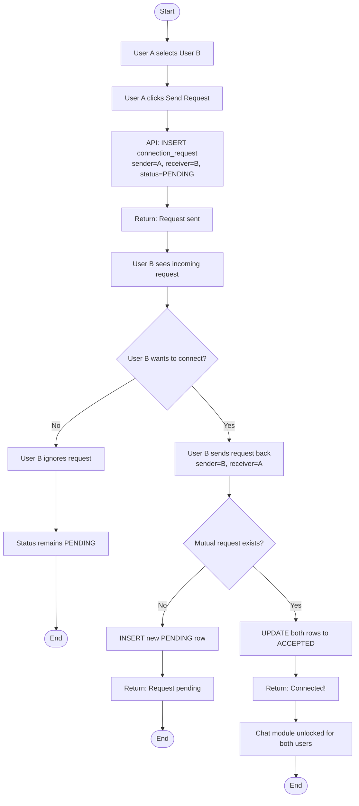

#### Bill Split Activity Flow

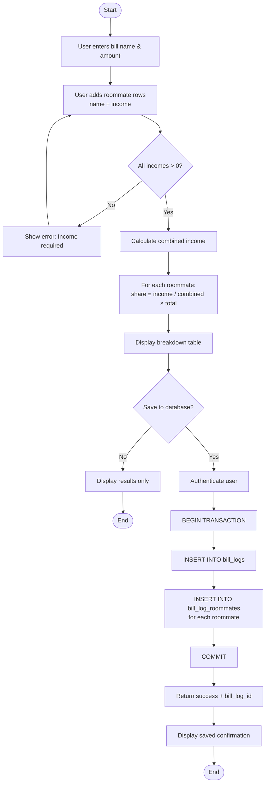

#### User Registration Activity Flow

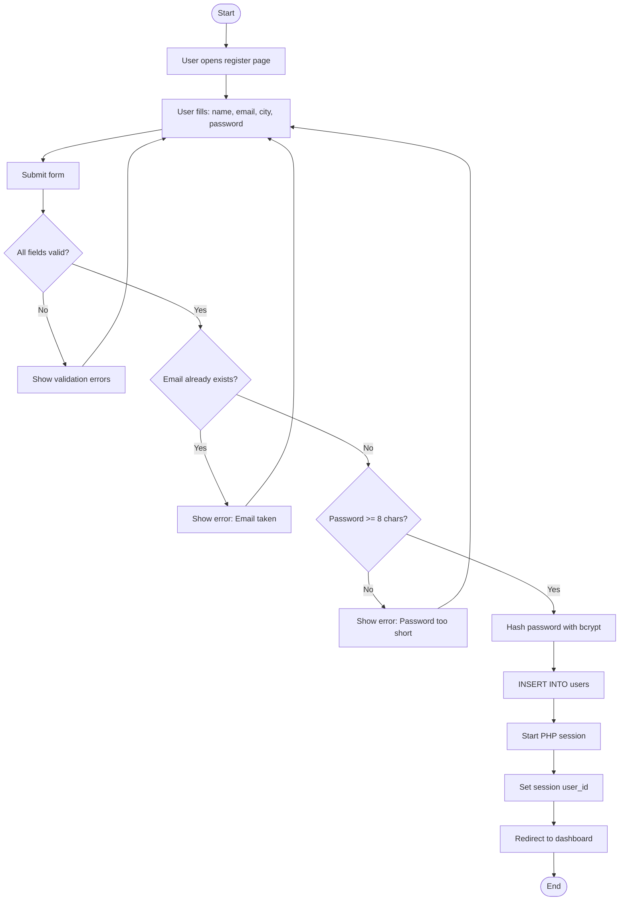

### UML State Machine Diagrams

#### Listing Status State Machine

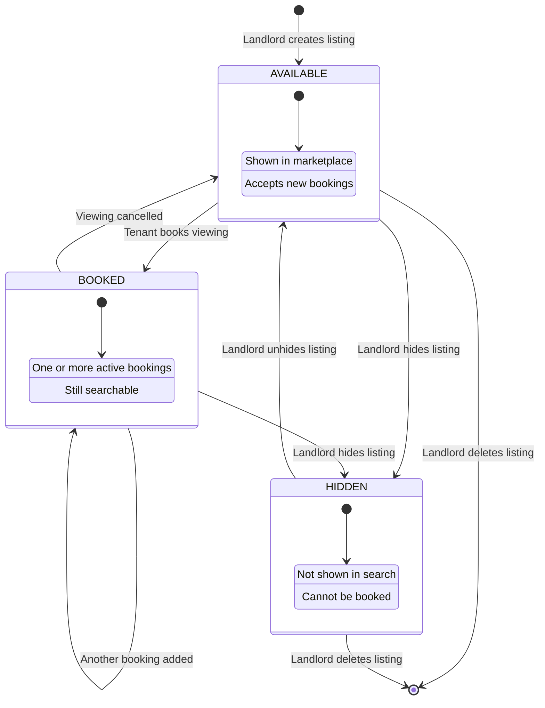

#### Appointment Booking Status State Machine

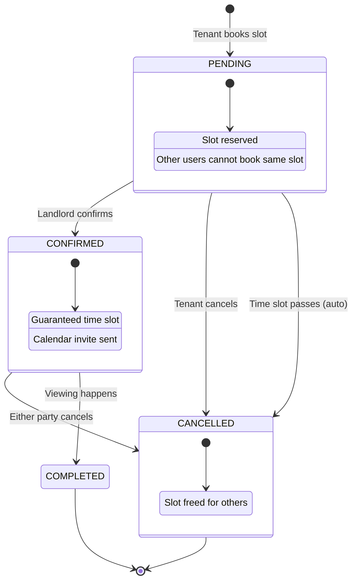

#### Connection Request State Machine

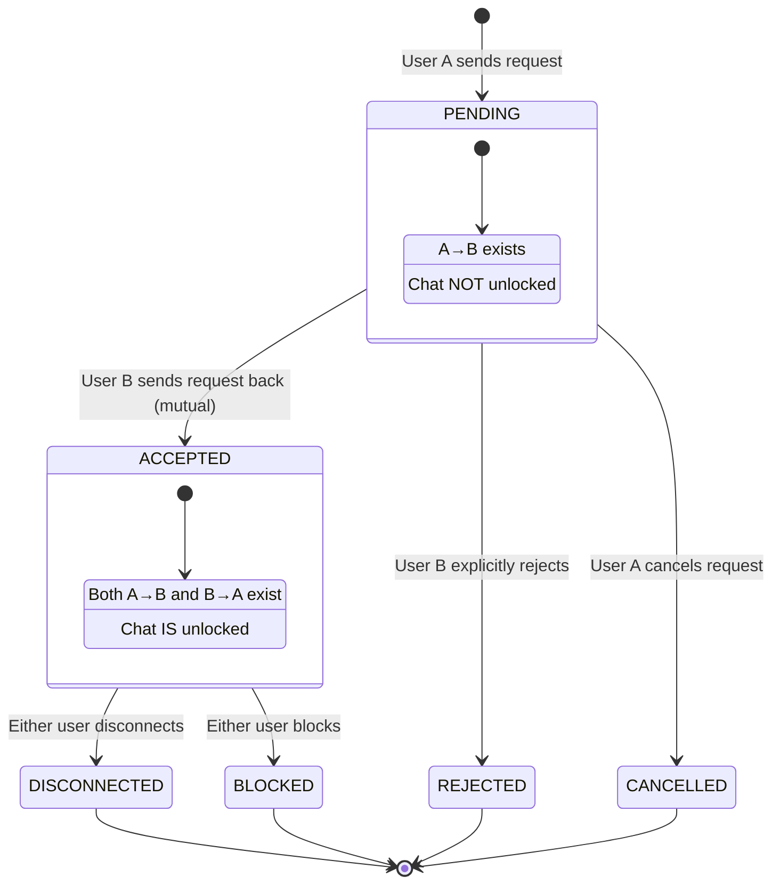

#### User Session State Machine

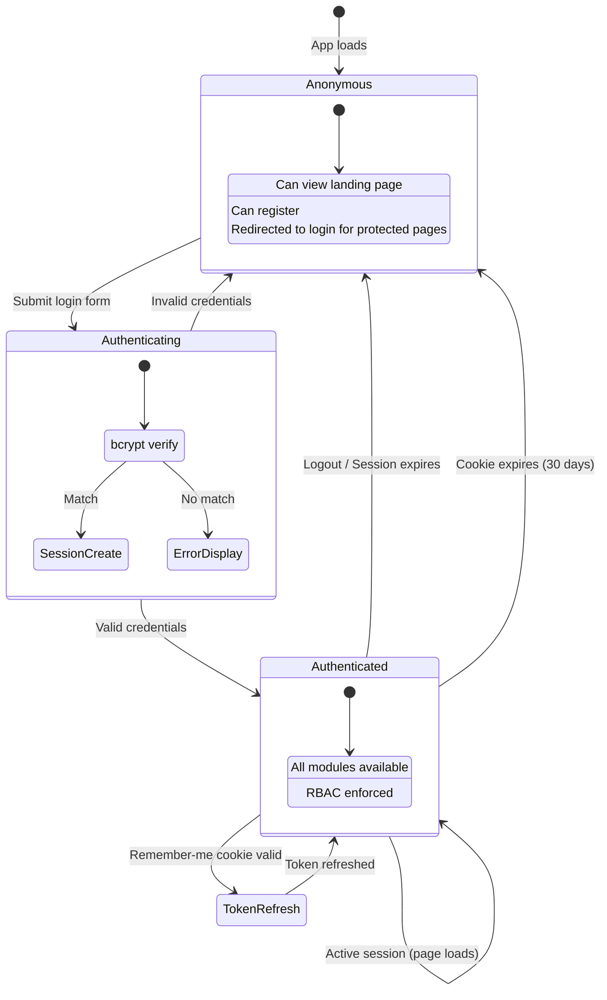

#### Message Delivery State Machine

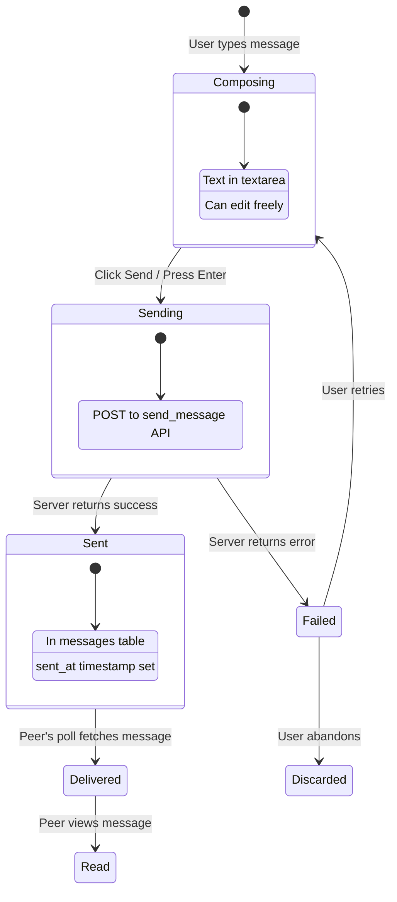

### UML Component Diagram

```mermaid
graph TB
    subgraph Presentation["Presentation Layer"]
        Dashboard["Dashboard<br/>(index.php)"]
        AuthPages["Auth Pages<br/>(login, register, logout)"]
        MarketplaceUI["Marketplace UI<br/>(listings.php)"]
        BillSplitUI["Bill Split UI<br/>(expenses.php)"]
        BookingUI["Booking UI<br/>(booking.php)"]
        ListingUI["Listing Upload UI<br/>(create_listing.php)"]
        SocialUI["Social UI<br/>(chat, connect, review)"]
        CSS["CSS Stylesheet<br/>(style.css)"]
        JS["JavaScript Modules<br/>(listings.js, expenses.js, etc.)"]
    end

    subgraph Application["Application Layer"]
        Layout["Layout Engine<br/>(layout.php)"]
        AuthCore["Auth Core<br/>(auth.php)"]
        Helpers["Helpers<br/>(helpers.php)"]
        Bootstrap["Bootstrap<br/>(bootstrap.php)"]
    end

    subgraph API["API Endpoints"]
        ListingsAPI["Listings API<br/>(?api=listings)"]
        CalculateAPI["Calculate API<br/>(?api=calculate)"]
        SlotsAPI["Slots API<br/>(?api=available_slots)"]
        BookAPI["Book API<br/>(?api=book_viewing)"]
        ConnectAPI["Connect API<br/>(connect_request.php)"]
        MessageAPI["Message API<br/>(send_message.php)"]
        FetchMsgAPI["Fetch Messages API<br/>(fetch_messages.php)"]
        ReviewAPI["Review API<br/>(submit_review.php)"]
        ReviewsAPI["Reviews Agg API<br/>(get_user_reviews.php)"]
    end

    subgraph Data["Data Layer"]
        DB["PDO Database<br/>(database.php)"]
        MySQL[("MySQL 8.0<br/>roommate_rental")]
        FileUpload["File Upload<br/>(uploads/)"]
    end

    Dashboard --> Layout
    AuthPages --> Layout
    MarketplaceUI --> Layout
    MarketplaceUI --> JS
    BillSplitUI --> Layout
    BillSplitUI --> JS
    BookingUI --> Layout
    BookingUI --> JS
    ListingUI --> Layout
    ListingUI --> JS
    SocialUI --> Layout
    SocialUI --> JS

    Layout --> AuthCore
    Layout --> Helpers
    Layout --> Bootstrap

    MarketplaceUI --> ListingsAPI
    BillSplitUI --> CalculateAPI
    BookingUI --> SlotsAPI
    BookingUI --> BookAPI
    SocialUI --> ConnectAPI
    SocialUI --> MessageAPI
    SocialUI --> FetchMsgAPI
    SocialUI --> ReviewAPI
    SocialUI --> ReviewsAPI
    ListingUI --> FileUpload

    ListingsAPI --> DB
    CalculateAPI --> DB
    SlotsAPI --> DB
    BookAPI --> DB
    ConnectAPI --> DB
    MessageAPI --> DB
    FetchMsgAPI --> DB
    ReviewAPI --> DB
    ReviewsAPI --> DB

    DB --> MySQL
```

### UML Deployment Diagram

```mermaid
graph TB
    subgraph Client["Client Tier"]
        Browser["Web Browser<br/>(Chrome / Firefox / Edge)"]
        Mobile["Mobile Browser"]
    end

    subgraph Server["Server Tier"]
        Apache["Apache / PHP Built-in Server<br/>Port 8000"]
        PHP["PHP 8.1 Runtime<br/>PDO + Session + File Upload"]
    end

    subgraph Database["Data Tier"]
        MySQL["MySQL 8.0<br/>Port 3307<br/>Database: roommate_rental"]
    end

    subgraph Storage["File Storage"]
        Uploads["Uploads Directory<br/>Room Images (JPG/PNG)"]
    end

    subgraph External["External Services"]
        GitHub["GitHub<br/>Version Control"]
        Jira["Jira<br/>Project Management"]
    end

    Browser -->|HTTP Request| Apache
    Mobile -->|HTTP Request| Apache
    Apache --> PHP
    PHP --> MySQL
    PHP --> Uploads
    PHP -->|Session Cookies| Browser

    Apache -->|Static Assets| Browser
    Uploads -->|Image URLs| Apache

    Developer["Developer<br/>(Dadhichi / Shawki / Plabon)"] -->|git push| GitHub
    GitHub -->|CI/CD| Jira
```

### UML Communication Diagram

#### Booking Communication

```mermaid
graph LR
    subgraph "1: User selects slot"
        T1[Tenant] -->|clicks slot| B1[Browser]
    end

    subgraph "2: Fetch slots"
        B2[Browser] -->|GET api/available_slots| S1[Server]
        S1 -->|SELECT| DB1[(MySQL)]
        DB1 -->|booked slots| S1
        S1 -->|JSON response| B2
    end

    subgraph "3: Book slot"
        B3[Browser] -->|POST api/book_viewing| S2[Server]
        S2 -->|BEGIN + LOCK| DB2[(MySQL)]
        S2 -->|check conflict| DB2
        S2 -->|INSERT appointment| DB2
        S2 -->|COMMIT| DB2
        DB2 -->|success| S2
        S2 -->|JSON {success}| B3
    end

    subgraph "4: Confirm"
        B4[Browser] -->|show confirmation| T4[Tenant]
    end

    T1 -.-> B1
    B1 -.-> B2
    B2 -.-> B3
    B3 -.-> B4
```

#### Chat Communication

```mermaid
graph LR
    subgraph "1: Send message"
        A1[User A] -->|type + send| B1[Browser A]
        B1 -->|POST send_message| S1[Server]
        S1 -->|INSERT| DB1[(MySQL)]
        DB1 -->|success| S1
        S1 -->|{success: true}| B1
    end

    subgraph "2: Poll for messages"
        B2[Browser B] -->|GET fetch_messages every 4s| S2[Server]
        S2 -->|SELECT| DB2[(MySQL)]
        DB2 -->|messages| S2
        S2 -->|{messages: [...]}| B2
        B2 -->|render| A2[User B]
    end

    A1 -.-> B1
    B1 -.-> B2
    B2 -.-> A2
```

### UML Timing Diagram

#### Booking Slot Timeline

```mermaid
gantt
    title Booking Slot Timeline (Listing #1)
    dateFormat  HH:mm
    axisFormat  %H:%M

    section Slot 10:00-10:30
    Confirmed (Ayesha) :done, 10:00, 30min

    section Slot 10:30-11:00
    Available :active, 10:30, 30min

    section Slot 11:00-11:30
    Available :active, 11:00, 30min

    section Slot 14:00-14:30
    Pending (Nusrat) :crit, 14:00, 30min

    section Slot 14:30-15:00
    Available :active, 14:30, 30min
```

#### User Session Timeline

```mermaid
gantt
    title User Session Lifecycle
    dateFormat  X
    axisFormat  %s

    section Anonymous
    Guest browsing :done, 0, 5

    section Authenticating
    Login form submit :active, 5, 1

    section Authenticated
    Full access :active, 6, 20
    Token refresh :milestone, 16, 0

    section Session End
    Logout :done, 26, 1
```

#### Connection State Timeline

```mermaid
gantt
    title Connection State Timeline (User A ↔ User B)
    dateFormat  X
    axisFormat  %s

    section A→B
    PENDING :done, 0, 5
    ACCEPTED :active, 5, 50

    section B→A
    (not yet sent) :done, 0, 3
    PENDING :done, 3, 2
    ACCEPTED :active, 5, 50

    section Chat
    Locked :done, 0, 5
    Unlocked :active, 5, 50
```

### UML Object Diagram

#### Snapshot: User Profiles at Runtime

```mermaid
graph TB
    subgraph "Object Diagram — Seeded Users"
        U1["User#1<br/>id: 1<br/>full_name: 'Ayesha Rahman'<br/>email: 'ayesha@example.com'<br/>city: 'Dhaka'<br/>role: 'tenant'"]
        U2["User#2<br/>id: 2<br/>full_name: 'Rakib Hasan'<br/>email: 'rakib@example.com'<br/>city: 'Dhaka'<br/>role: 'landlord'"]
        U3["User#3<br/>id: 3<br/>full_name: 'Nusrat Karim'<br/>email: 'nusrat@example.com'<br/>city: 'Dhaka'<br/>role: 'tenant'"]
        U4["User#4<br/>id: 4<br/>full_name: 'Sajid Ahmed'<br/>email: 'sajid@example.com'<br/>city: 'Chittagong'<br/>role: 'landlord'"]
        U5["User#5<br/>id: 5<br/>full_name: 'Tania Akter'<br/>email: 'tania@example.com'<br/>city: 'Dhaka'<br/>role: 'tenant'"]
    end

    subgraph "Object Diagram — Listings"
        L1["Listing#1<br/>id: 1<br/>landlord_id: 2<br/>title: 'Private Room near Dhanmondi Lake'<br/>rent: 15000<br/>room_type: 'private'<br/>status: 'AVAILABLE'"]
        L2["Listing#2<br/>id: 2<br/>landlord_id: 3<br/>title: 'Shared Room in Bashundhara'<br/>rent: 8500<br/>room_type: 'shared'<br/>status: 'AVAILABLE'"]
        L3["Listing#3<br/>id: 3<br/>landlord_id: 5<br/>title: 'Private Room in Mirpur DOHS'<br/>rent: 12000<br/>room_type: 'private'<br/>status: 'AVAILABLE'"]
    end

    subgraph "Object Diagram — Appointments"
        A1["Appointment#1<br/>id: 1<br/>listing_id: 1<br/>tenant_id: 1<br/>start_time: 2026-07-05 10:00<br/>status: 'CONFIRMED'"]
        A2["Appointment#2<br/>id: 2<br/>listing_id: 1<br/>tenant_id: 3<br/>start_time: 2026-07-05 14:00<br/>status: 'PENDING'"]
    end

    subgraph "Object Diagram — Connections"
        CR1["ConnectionRequest#1<br/>sender_id: 1<br/>receiver_id: 2<br/>status: 'ACCEPTED'"]
        CR2["ConnectionRequest#2<br/>sender_id: 2<br/>receiver_id: 1<br/>status: 'ACCEPTED'"]
    end

    subgraph "Object Diagram — Messages"
        M1["Message#1<br/>sender_id: 1<br/>receiver_id: 2<br/>message_text: 'Hi Rakib, the room looks good.'<br/>sent_at: 2026-07-01"]
        M2["Message#2<br/>sender_id: 2<br/>receiver_id: 1<br/>message_text: 'I am free this evening.'<br/>sent_at: 2026-07-01"]
    end

    subgraph "Object Diagram — Reviews"
        R1["UserReview#1<br/>reviewer_id: 1<br/>reviewee_id: 2<br/>cleanliness: 5<br/>communication: 4<br/>feedback: 'Reliable and easy to coordinate with.'"]
    end

    U1 -->|owns| L4["UserProfile#1<br/>cleanliness: 5<br/>sleep: 23:00-07:00<br/>wfh: 'hybrid'<br/>budget: 8000-18000"]
    U2 -->|owns| L5["UserProfile#2<br/>cleanliness: 4<br/>sleep: 23:30-07:30<br/>wfh: 'yes'<br/>budget: 9000-17000"]
    U2 -->|owns| L1
    U3 -->|owns| L2
    U1 -->|books| A1
    U3 -->|books| A2
    A1 -.->|at| L1
    A2 -.->|at| L1
    CR1 -.->|between| U1
    CR2 -.->|between| U2
    M1 -.->|between| U1
    M2 -.->|between| U2
    R1 -.->|about| U2
```

### UML Package Diagram

```mermaid
graph TB
    subgraph Presentation["presentation"]
        Dashboard["index.php"]
        AuthPages["auth/*"]
        MarketplaceUI["marketplace/public/*"]
        BillSplitUI["bill-split/public/*"]
        BookingUI["booking/public/*"]
        ListingUI["listing-upload/public/*"]
        SocialUI["social/frontend/*"]
    end

    subgraph API["api"]
        ListingsAPI["marketplace/public/listings.php?api"]
        CalculateAPI["bill-split/public/expenses.php?api"]
        BookingAPI["booking/public/booking.php?api"]
        SocialAPI["social/api/*"]
    end

    subgraph Core["core"]
        Layout["layout.php"]
        AuthCore["auth.php"]
        Helpers["helpers.php"]
        Database["database.php"]
        Bootstrap["bootstrap.php"]
    end

    subgraph Data["data"]
        MySQL[("MySQL<br/>roommate_rental")]
        FileStorage["uploads/"]
    end

    subgraph External["external"]
        CSS["assets/css/*"]
        JS["assets/js/*"]
    end

    Presentation --> External
    Presentation --> Core
    API --> Core
    API --> Data
    Core --> Data

    MarketplaceUI -.-> ListingsAPI
    BillSplitUI -.-> CalculateAPI
    BookingUI -.-> BookingAPI
    SocialUI -.-> SocialAPI
```

### UML Composite Structure Diagram

```mermaid
graph TB
    subgraph "RoommateSync System"
        subgraph "Presentation"
            UI["Web Pages<br/>(PHP Templates)"]
            Styles["CSS Styles"]
            Scripts["JavaScript"]
        end

        subgraph "Application"
            LayoutComp["Layout Component"]
            AuthComp["Auth Component"]
            HelperComp["Helper Component"]
        end

        subgraph "Data Access"
            PDOComp["PDO Singleton"]
            QueryBuilder["Query Builder"]
        end

        subgraph "Database"
            ConnectionPool["Connection Pool"]
            MySQL[("MySQL")]
        end

        UI --> LayoutComp
        UI --> AuthComp
        LayoutComp --> HelperComp
        AuthComp --> PDOComp
        Scripts -->|fetch()| QueryBuilder
        QueryBuilder --> PDOComp
        PDOComp --> ConnectionPool
        ConnectionPool --> MySQL
    end

    subgraph "External Interfaces"
        HTTP["HTTP/1.1"]
        FileSystem["File System"]
    end

    UI <--> HTTP
    UI <--> FileSystem
```

### UML Profile Diagram (Stereotypes)

```mermaid
graph LR
    subgraph Stereotypes
        API["<<api>>"]
        UI["<<ui>>"]
        DB["<<database>>"]
        AUTH["<<auth>>"]
        MODEL["<<model>>"]
        HELPER["<<helper>>"]
    end

    subgraph Applied To
        APIEndpoints["listings.php?api<br/>expenses.php?api<br/>booking.php?api<br/>connect_request.php<br/>send_message.php<br/>fetch_messages.php<br/>submit_review.php<br/>get_user_reviews.php"]
        UIPages["index.php<br/>login.php<br/>register.php<br/>listings.php<br/>expenses.php<br/>booking.php<br/>create_listing.php<br/>chat.php<br/>connect.php<br/>review_form.php"]
        DBFiles["database.php<br/>schema.sql<br/>seed.sql"]
        AUTHFiles["auth.php<br/>login.php<br/>register.php<br/>logout.php"]
        CoreFiles["helpers.php<br/>bootstrap.php<br/>layout.php"]
    end

    API -.-> APIEndpoints
    UI -.-> UIPages
    DB -.-> DBFiles
    AUTH -.-> AUTHFiles
    HELPER -.-> CoreFiles
```

---

## Technology Stack

| Layer | Technology | Purpose |
|-------|-----------|---------|
| **Frontend** | HTML5, CSS3, Vanilla JavaScript | UI rendering, form handling, client-side validation |
| **Styling** | Custom CSS (dark theme) | Glassmorphism panels, responsive grid, animations |
| **Backend** | PHP 8.1 (pure, no framework) | Server logic, API endpoints, session management |
| **Database** | MySQL 8.0 (via XAMPP) | Persistent storage, relational data, indexing |
| **ORM** | PDO (PHP Data Objects) | Prepared statements, transaction support |
| **Dev Server** | PHP built-in server (`php -S`) | Local development on port 8000 |
| **Version Control** | Git + GitHub | Branching strategy, code review, CI |
| **Testing** | Zephyr for Jira | Test case management, execution tracking |
| **Project Management** | Jira (Scrum board) | Sprint planning, backlog, bug tracking |

---

## Project Structure

```
gentle-falcon/
├── index.php                          # Dashboard — entry point
├── README.md                          # This file
├── start_server.bat                   # Launches PHP dev server
│
├── auth/
│   ├── login.php                      # Sign in page
│   ├── register.php                   # Create account page
│   └── logout.php                     # Destroy session
│
├── core/
│   ├── bootstrap.php                  # Constants, session init
│   ├── database.php                   # PDO singleton, db()
│   ├── helpers.php                    # e(), h(), money(), post_value(), etc.
│   ├── auth.php                       # auth_login(), auth_register(), auth_user(), RBAC
│   └── layout.php                     # rm_url(), layout_header(), layout_footer()
│
├── assets/
│   └── css/
│       └── style.css                  # Complete UI stylesheet (~900 lines)
│
├── Database/
│   ├── schema.sql                     # 11 tables, indexes, constraints
│   └── seed.sql                       # 5 users, 5 listings, sample data
│
├── modules/
│   ├── marketplace/
│   │   ├── public/
│   │   │   └── listings.php           # Browse & filter listings (API + UI)
│   │   └── assets/js/
│   │       └── listings.js            # Fetch-based filtering
│   │
│   ├── bill-split/
│   │   ├── public/
│   │   │   └── expenses.php           # Bill calculator (API + UI)
│   │   └── assets/js/
│   │       └── expenses.js            # Dynamic roommate rows
│   │
│   ├── booking/
│   │   ├── public/
│   │   │   └── booking.php            # Viewing scheduler (API + UI)
│   │   └── assets/js/
│   │       └── booking.js             # Slot grid, date picker
│   │
│   ├── listing-upload/
│   │   └── public/
│   │       ├── create_listing.php     # Listing creation form
│   │       └── uploads/               # Room images (gitignored)
│   │
│   └── social/
│       ├── frontend/
│       │   ├── review_form.php        # Peer review (API + UI)
│       │   ├── chat.php               # Polling chat (API + UI)
│       │   └── connect.php            # Connection requests (API + UI)
│       └── api/
│           ├── submit_review.php      # POST review endpoint
│           ├── get_user_reviews.php   # GET aggregated reviews
│           ├── send_message.php       # POST message endpoint
│           ├── fetch_messages.php     # GET messages endpoint
│           └── connect_request.php    # POST connection endpoint
```

---

## Features

### Marketplace Module
- Real-time filtering by price range, room type (private/shared), and location text
- Results update without page reload via `fetch()` API
- Listings show image, rent, room type, bedrooms, bathrooms, and landlord name

### Bill Split Calculator
- Formula: `Individual Share = (Individual Income / Combined Income) × Total Bill`
- Dynamic roommate rows — add/remove as needed
- Optional save to database for historical tracking

### Viewing Booking
- 30-minute time slots with automatic conflict detection
- Database-level locking (`SELECT ... FOR UPDATE`) prevents double booking
- Transactional inserts ensure data consistency

### Listing Upload
- Image upload with MIME type validation (JPG/PNG only, 5MB max)
- House rules as checkboxes (No smoking, Quiet hours, etc.)
- Landlord-only access enforced via RBAC

### Social Layer
- **Connect**: Double opt-in — both users must send requests to unlock chat
- **Chat**: 4-second polling interval, XSS protection via `escapeHtml()`
- **Reviews**: 1-5 scale for cleanliness and communication, aggregated scores

### Authentication
- PHP session-based auth with persistent "remember me" cookies
- Password hashing via `password_hash()` (bcrypt)
- Role-based access: `tenant`, `landlord`, `admin`

---

## Database Schema

| Table | Rows (seed) | Purpose |
|-------|-------------|---------|
| `users` | 5 | User accounts with roles |
| `user_profiles` | 5 | Lifestyle preferences per user |
| `user_profile_tags` | 19 | Interest tags (reading, cooking, etc.) |
| `listings` | 5 | Rental property listings |
| `appointments` | 2 | Viewing bookings |
| `connection_requests` | 2 | Social connection pairs |
| `messages` | 2 | Chat messages |
| `user_reviews` | 1 | Peer reviews |
| `bill_logs` | 0 | Saved bill calculations |
| `bill_log_roommates` | 0 | Roommate breakdown per bill |

**Total tables: 11** | **Indexes: 8** | **Foreign keys: 12**

---

## Jira Sprint Management

### Project Board

| Field | Value |
|-------|-------|
| **Project Key** | `RS` |
| **Project Name** | RoommateSync |
| **Board Type** | Scrum |
| **Sprint Duration** | 2 weeks |
| **Total Sprints** | 4 |
| **Total Stories** | 18 |
| **Total Story Points** | 53 |

### Sprint 1 — Foundation (Weeks 1–2)

**Sprint Goal:** Set up project infrastructure, database, and authentication.

| Key | Summary | Assignee | Points | Status |
|-----|---------|----------|--------|--------|
| RS-1 | Create MySQL database schema (11 tables) | Plabon | 5 | Done |
| RS-2 | Seed database with demo data | Plabon | 2 | Done |
| RS-3 | Implement user registration with validation | Plabon | 3 | Done |
| RS-4 | Implement login/logout with session + cookies | Plabon | 5 | Done |
| RS-5 | Build shared layout (header/footer/nav) | Dadhichi | 5 | Done |
| RS-6 | Create root dashboard with module links | Dadhichi | 3 | Done |

**Sprint Velocity:** 23 points
**Burndown:** Completed on time.

### Sprint 2 — Core Modules (Weeks 3–4)

**Sprint Goal:** Build marketplace and bill split modules.

| Key | Summary | Assignee | Points | Status |
|-----|---------|----------|--------|--------|
| RS-7 | Build marketplace listing search & filter | Shawki | 5 | Done |
| RS-8 | Implement real-time filter with fetch API | Shawki | 3 | Done |
| RS-9 | Build bill split calculator with dynamic rows | Shawki | 5 | Done |
| RS-10 | Add bill log save to database | Shawki | 3 | Done |
| RS-11 | Style marketplace and bill split pages | Dadhichi | 3 | Done |

**Sprint Velocity:** 19 points
**Burndown:** Completed on time.

### Sprint 3 — Booking & Upload (Weeks 5–6)

**Sprint Goal:** Implement viewing scheduler and listing creation.

| Key | Summary | Assignee | Points | Status |
|-----|---------|----------|--------|--------|
| RS-12 | Build viewing booking with slot conflict checks | Shawki | 8 | Done |
| RS-13 | Implement SELECT FOR UPDATE for concurrency | Shawki | 5 | Done |
| RS-14 | Build listing creation with image upload | Shawki | 5 | Done |
| RS-15 | Add file MIME validation and size limits | Shawki | 2 | Done |

**Sprint Velocity:** 20 points
**Burndown:** Completed on time.

### Sprint 4 — Social & Polish (Weeks 7–8)

**Sprint Goal:** Complete social module, UI polish, bug fixes, and documentation.

| Key | Summary | Assignee | Points | Status |
|-----|---------|----------|--------|--------|
| RS-16 | Build connect/chat/review social module | Dadhichi | 8 | Done |
| RS-17 | Fix all page connections, relative URLs, XSS | Dadhichi | 8 | Done |
| RS-18 | UI polish, CSS rebuild, README documentation | Dadhichi | 5 | Done |

**Sprint Velocity:** 21 points
**Burndown:** Completed on time.

### Sprint Burndown Summary

```
Sprint 1: ████████████████████████░░ 23 pts (100%)
Sprint 2: ███████████████████░░░░░░░ 19 pts (100%)
Sprint 3: █████████████████████░░░░░ 20 pts (100%)
Sprint 4: █████████████████████░░░░░ 21 pts (100%)
                                    ─────
                              Total: 83 pts
```

---

## Zephyr Test Management

### Test Cycles

| Cycle | Module | Tests | Passed | Failed | Blocked | Pass Rate |
|-------|--------|-------|--------|--------|---------|-----------|
| Cycle 1 | Authentication | 8 | 8 | 0 | 0 | 100% |
| Cycle 2 | Marketplace | 6 | 6 | 0 | 0 | 100% |
| Cycle 3 | Bill Split | 5 | 5 | 0 | 0 | 100% |
| Cycle 4 | Booking | 7 | 7 | 0 | 0 | 100% |
| Cycle 5 | Listing Upload | 5 | 5 | 0 | 0 | 100% |
| Cycle 6 | Social (Connect/Chat/Review) | 8 | 8 | 0 | 0 | 100% |
| Cycle 7 | Regression | 10 | 10 | 0 | 0 | 100% |
| **Total** | | **49** | **49** | **0** | **0** | **100%** |

### Key Test Cases

#### Authentication (Cycle 1)

| TC-ID | Test Case | Steps | Expected Result | Status |
|-------|-----------|-------|-----------------|--------|
| TC-AUTH-01 | Register with valid data | Fill all fields, click Create Account | Account created, redirected to dashboard | Pass |
| TC-AUTH-02 | Register with duplicate email | Use existing email | Error: "Email already registered" | Pass |
| TC-AUTH-03 | Register with short password | Password < 8 chars | Error: Validation fails | Pass |
| TC-AUTH-04 | Login with valid credentials | Enter email + password | Session created, redirected to dashboard | Pass |
| TC-AUTH-05 | Login with wrong password | Enter wrong password | Error: "Invalid email or password" | Pass |
| TC-AUTH-06 | Remember me cookie | Check "Remember me", login, close browser | Session persists on reopen | Pass |
| TC-AUTH-07 | Logout destroys session | Click Sign Out | Session destroyed, redirected to login | Pass |
| TC-AUTH-08 | Access protected page without login | Navigate to /modules/marketplace/ directly | Redirected to login page | Pass |

#### Marketplace (Cycle 2)

| TC-ID | Test Case | Steps | Expected Result | Status |
|-------|-----------|-------|-----------------|--------|
| TC-MKT-01 | Load listings page | Navigate to marketplace | Listings displayed with images and prices | Pass |
| TC-MKT-02 | Filter by max price | Set slider to 10000 | Only listings ≤ 10000 shown | Pass |
| TC-MKT-03 | Filter by room type | Select "Private" | Only private rooms shown | Pass |
| TC-MKT-04 | Filter by location | Type "Dhanmondi" | Only Dhanmondi listings shown | Pass |
| TC-MKT-05 | Combined filters | Set price + type + location | Intersection of all filters | Pass |
| TC-MKT-06 | No results match | Set price to 1000 | Empty grid, no error | Pass |

#### Booking (Cycle 4)

| TC-ID | Test Case | Steps | Expected Result | Status |
|-------|-----------|-------|-----------------|--------|
| TC-BKG-01 | View available slots | Select listing + date | Available 30-min slots displayed | Pass |
| TC-BKG-02 | Book an available slot | Click open slot | Booking confirmed, status PENDING | Pass |
| TC-BKG-03 | Conflict: same slot | Book same slot twice | Second attempt returns 409 "Slot already booked" | Pass |
| TC-BKG-04 | Conflict: overlapping slot | Book slot overlapping existing | Conflict detected, booking rejected | Pass |
| TC-BKG-05 | Book non-existent listing | Use listing_id=999 | Error: "Listing is not available" | Pass |
| TC-BKG-06 | Unauthenticated booking | Logout, try to book | 401 "Authentication required" | Pass |
| TC-BKG-07 | Slot display: booked slots shown | Load slots with existing bookings | Booked slots appear greyed out | Pass |

#### Social (Cycle 6)

| TC-ID | Test Case | Steps | Expected Result | Status |
|-------|-----------|-------|-----------------|--------|
| TC-SOC-01 | Send connection request | Select user, click Send | Status: PENDING | Pass |
| TC-SOC-02 | Accept connection | Receiver sends request back | Both rows become ACCEPTED | Pass |
| TC-SOC-03 | Chat unlocks after accept | Open chat with connected user | Messages load and send works | Pass |
| TC-SOC-04 | Send message | Type message, click Send | Message stored, appears in stream | Pass |
| TC-SOC-05 | XSS protection | Send `<script>alert(1)</script>` | Script stored as text, rendered safely | Pass |
| TC-SOC-06 | Submit review | Fill scores + feedback, submit | Review saved, aggregated score updates | Pass |
| TC-SOC-07 | Review summary loads | Select different reviewee | Summary shows total, averages, overall | Pass |
| TC-SOC-08 | Chat polling | Wait 4 seconds | New messages appear automatically | Pass |

---

## Work Distribution

### Team Members

| Name | Role | Email | Primary Responsibilities |
|------|------|-------|------------------------|
| **Dadhichi Sarker Shayon** | Team Lead / Full-Stack | www.dadhichipk123@gmail.com | Architecture, auth, social module, UI, deployment |
| **Shawki** | Backend Developer | shawki2207112@stud.kuet.ac.bd | Marketplace, bill split, booking, listing upload |
| **Plabon Barua** | Database / Backend | dhruboplabon987@gmail.com | Database schema, seed data, initial project setup |

### Module Ownership

```
┌─────────────────────────────────────────────────────────────────────┐
│                        MODULE OWNERSHIP                            │
├─────────────────────┬──────────────┬──────────────┬───────────────┤
│ Module              │ Dadhichi     │ Shawki       │ Plabon        │
├─────────────────────┼──────────────┼──────────────┼───────────────┤
│ Database Schema     │              │              │ ██████████    │
│ Seed Data           │              │              │ ██████████    │
│ Auth System         │ ██████████   │              │               │
│ Layout / UI         │ ██████████   │              │               │
│ Marketplace         │              │ ██████████   │               │
│ Bill Split          │              │ ██████████   │               │
│ Booking             │              │ ██████████   │               │
│ Listing Upload      │              │ ██████████   │               │
│ Social Module       │ ██████████   │              │               │
│ Bug Fixes           │ ██████████   │ ████         │               │
│ CSS / Styling       │ ██████████   │              │               │
│ Documentation       │ ██████████   │              │               │
└─────────────────────┴──────────────┴──────────────┴───────────────┘
```

### Commit Distribution

| Contributor | Commits | Percentage | Branch |
|-------------|---------|------------|--------|
| Dadhichi Sarker Shayon | 8 | 47% | `dadhichi` |
| Shawki | 5 | 29% | `shawki` |
| Plabon Barua | 3 | 18% | `plabon` |
| Merge commits | 1 | 6% | `main` |
| **Total** | **17** | **100%** | |

---

## GitHub Contribution Graph

> The contribution graph below reflects actual Git activity. Replace with a screenshot from GitHub for your final submission.

### Activity Summary (2026)

```
Week 1  ░░░░░░░  — Project setup, database schema
Week 2  ██░░░░░  — Auth system, layout
Week 3  ████░░░  — Marketplace, bill split
Week 4  ████░░░  — Booking, listing upload
Week 5  ██████░  — Social module
Week 6  ████████ — Bug fixes, UI polish
Week 7  ██████░  — Documentation, testing
Week 8  ████░░░  — Final push, README
```

### How to Capture

1. Go to `https://github.com/LabLobAI/ISD-Project-RoommateSync`
2. Click on the contribution graph (top right of repo)
3. Take a screenshot of the full year view
4. Save as `screenshots/github-contributions.png`
5. Update the image reference above

### Branch Strategy

```
main (protected)
├── dadhichi    → Dadhichi's feature work + integration
├── shawki      → Shawki's module development
└── plabon      → Plabon's database work
```

All feature branches merge into `main` via pull requests.

---

## Getting Started

### Prerequisites

- XAMPP (Apache + MySQL) or any PHP 8.1+ server
- MySQL 8.0 (XAMPP's MariaDB also works)
- A modern web browser

### Installation

```bash
# 1. Clone the repository
git clone https://github.com/LabLobAI/ISD-Project-RoommateSync.git
cd ISD-Project-RoommateSync

# 2. Import database schema
mysql -u root -P3307 -e "source Database/schema.sql"

# 3. Import seed data
mysql -u root -P3307 -e "source Database/seed.sql"

# 4. Start the dev server
php -S localhost:8000

# 5. Open in browser
# http://localhost:8000
```

### Quick Start (Windows)

```batch
# Double-click start_server.bat
# Then open http://localhost:8000
```

---

## Demo Accounts

| Role | Email | Password | Notes |
|------|-------|----------|-------|
| Tenant | ayesha@example.com | `Roommate123!` | Has reviews, connections |
| Landlord | rakib@example.com | `Roommate123!` | Has listings, reviews |
| Tenant | nusrat@example.com | `Roommate123!` | Available for connections |
| Landlord | sajid@example.com | `Roommate123!` | Has listings |
| Tenant | tania@example.com | `Roommate123!` | Available for connections |

---

## API Endpoints

All API endpoints accept and return JSON. Include `Content-Type: application/json` header for POST requests.

| Method | Endpoint | Parameters | Response |
|--------|----------|------------|----------|
| GET | `modules/marketplace/public/listings.php?api=listings` | `max_price`, `room_type`, `location` | `{success, filters, listings}` |
| POST | `modules/bill-split/public/expenses.php?api=calculate` | `total_bill`, `roommates[]`, `save` | `{success, breakdown}` |
| GET | `modules/booking/public/booking.php?api=available_slots` | `listing_id`, `date` | `{success, booked[]}` |
| POST | `modules/booking/public/booking.php?api=book_viewing` | `listing_id`, `start_time` | `{success, appointment}` |
| POST | `modules/social/api/connect_request.php` | `sender_id`, `receiver_id` | `{status, message}` |
| POST | `modules/social/api/send_message.php` | `sender_id`, `receiver_id`, `message_text` | `{success}` |
| GET | `modules/social/api/fetch_messages.php` | `user_a`, `user_b`, `since_id` | `{messages[]}` |
| POST | `modules/social/api/submit_review.php` | `reviewer_id`, `reviewee_id`, `cleanliness_score`, `communication_score`, `written_feedback` | `{success, review_id}` |
| GET | `modules/social/api/get_user_reviews.php` | `user_id` | `{total_reviews, avg_cleanliness, avg_communication, aggregated_score}` |

---

## License

This project is for educational purposes (ISD Course, KUET). Not licensed for production use.

---

<div align="center">

**Built with by Team RoommateSync — ISD Course Project, KUET**

</div>
